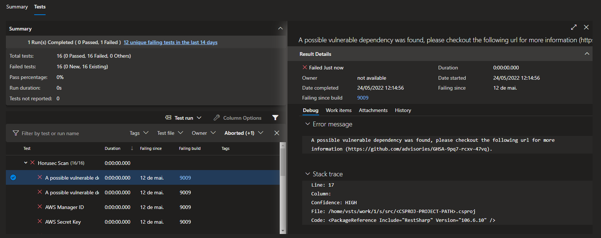

# Horusec

Mais informações:
[https://docs.horusec.io/docs/pt-br/overview/](https://docs.horusec.io/docs/pt-br/overview/)


---


## Configurando Horus Scan Job


## Exemplo Report


### Exemplo:

```jsx
pool:
  name: Azure Pipelines
steps:
- script: |
   curl -o HorusecScanSimpleTask.py https://raw.githubusercontent.com/vagners/azure-pipelines/master/devsecops/horussec/HorusecScanSimpleTask.py
   
  displayName: 'Download Horus task'

- task: UsePythonVersion@0
  displayName: 'Use Python 3.x'

- task: PythonScript@0
  displayName: 'Run a Python script'
  inputs:
    scriptPath: HorusecScanSimpleTask.py
    arguments: '-p . -o "horusec-junit.xml"'

- task: PublishTestResults@2
  displayName: 'Publish Test Results *junit.xml'
  inputs:
    testResultsFiles: '*junit.xml'
    mergeTestResults: true
    testRunTitle: 'Horusec Scan'
```
